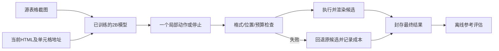

# OCR-EDR-Extend

**目标：让小模型改对 OCR 错误，不改坏正确内容。**

**目前发现：重复行会修，真实错误还修不稳。**

**当前验证：先告诉它错在哪里，能不能让它改得更准。**

这是基于 [OCR-EDR](https://arxiv.org/html/2609.03445v1) 的独立公式／表格纠错研究。现阶段是小模型监督训练、机制消融与开发评估，**尚未完成完整闭环、RL、Jev 级联或独立迁移验证**。

## 先从哪里看

- **看图理解进展**：[在线研究网页](https://lifelonglearneradam.github.io/ocr-edr-extend/)，包含流程图、前后案例、实验对照表、学长材料和运行进度。
- **准备汇报**：[三句话概括、相关工作、五分钟稿与追问回答](docs/research/REPORTING_GUIDE_20261009.md)。网页也有“组会怎么汇报”。
- **核对研究设计**：[五方向统一设计](docs/research/INTEGRATED_RESEARCH_20261006.md)，区分任务、提议、核验、控制和迁移。
- **核对实际成果**：先读下方结果表，再打开每项的原协议与证据目录。未执行的部分没有成绩。

终端里蓝色链接打不开时，复制这一行到浏览器地址栏：

```text
https://lifelonglearneradam.github.io/ocr-edr-extend/
```

本项目位于 `optimization/ocr-edr-team`；当前 Linux 研究副本为 `~/research/optimization/ocr-edr-team`。`noteresearch` 的 MonkeyOCR Note 是另一项目，数据、训练记录和结果不混用。

## 1. 目前到底用了什么方法

**已实际使用：Qwen2-VL-2B + LoRA 监督微调（SFT）+ 单步局部编辑。**

| 环节 | 实际做法 | 为什么做 |
|---|---|---|
| 训练数据 | 同一真实表格配正确候选、数字扰动、重复行、部分跨度扰动 | 已知构造位置能形成可检查的修改目标；但不等于覆盖真实 OCR 错误 |
| 监督微调 | 错候选教正确动作，正确候选教 `stop`；原模型冻结，只更新语言模型 LoRA | 让小模型学修改，并学习不随意改正确内容 |
| 模型输入 | 原表格截图 + 当前 HTML + 从该 HTML 算出的行／单元格地址 | 源图提供依据，候选提供可执行位置；推断不给参考答案 |
| 模型输出 | 只输出一个 JSON 动作：`stop`、`replace_cell`、`set_span`、`delete_row` | 限制修改范围，让行为能逐次核对 |
| 执行检查 | 检查 JSON、索引、预算和渲染；非法、触顶或渲染失败回退 | 保证动作可执行，保留失败和成本；它尚不判断视觉正确性 |
| 离线评估 | 输出冻结后，才与发布参考比较 TEDS／TEDS-S；公式另用 core CDM | 区分修复与误改，避免在生成时泄漏答案 |

**正在新增：单独训练类别／位置诊断模型，再接固定修复器做对照。** 它只输出“是否可疑、什么错误、当前候选哪里错”，不提供正确文本。新模型已启动训练，质量结果尚未产出。

LoRA 是给模型增加少量可训练参数，不是从零训练整个 2B 模型。现有两臂表格训练各更新约 **54.5 万个参数**、执行 **381 步／1,524 次样例暴露**。这只是训练预算，不等于训练后一定会纠错。

### 当前表格推理流程



这幅图是已执行的单步流程。**独立视觉验收和多轮学习控制尚未接成有效系统**；离线评测不能冒充部署时的核验器。

## 2. 用一个真实案例理解模型在干什么

样本 `p0153-cell_perturbation` 来自 PMC4733134，使用描述式提示，相关格内容如下：

| 对象 | 数字 | 正常 Total 行 | 结果 |
|---|---|---|---|
| 源图 | 17.3 | 100.0 | 纠错依据 |
| 给模型的候选 | 27.3 | 100.0 | 只扰动了数字，没有多余 Total |
| 含保持训练模型 | 27.3 | 保留 | 输出 `stop`，没有修数字 |
| 去保持训练模型 | 27.3 | 被删除 | 输出 `delete_row(row=11)`，原数字错误还在，又漏了一行 |

所以“输出合法 JSON”“执行了修改”“分数接近 1”都不表示修对。我们需要分开解决：**发现差异 → 对准位置 → 改对内容 → 核验没有新伤害**。

网页还有三个对照案例：受控重复行修复、本来正确的表格被改坏、原生候选的真实标准差行被误删。案例中的表格是局部转写，完整输入和输出哈希绑定冻结实验，不是重新编造演示成绩。

## 3. 已完成的主要实验与结论

### 表格：先看完整分母，再看平均分

| 实验条件 | 输入范围 | 含保持训练 `all` | 去显式保持训练 | 结论 |
|---|---|---|---|---|
| 首轮字面 JSON 示例 | 103 个受控候选／32 篇文章 | 0/71 全修复；12/32 原满分退化；TEDS 0.938526 | 0/71；12/32；TEDS 0.907277 | 两臂都低于同精度 base 0.957543；负结果完整保留 |
| 固定 checkpoint，描述式提示 | 同 103 个受控候选 | 31/71 全修复；0/32 退化；TEDS 0.994362 | 48/71；14/32；TEDS 0.977806 | 提示和目标分布影响行为；`all` 的31个修复全部是受控重复行，数字／跨度未修 |
| 真实 PaddleOCR 原生候选 | 每源一条，共32源 | 0/19 全修复；1/13 退化；TEDS 0.977268 | 0/19；7/13；TEDS 0.947725 | 两学生也无部分 TEDS 提高；原生基线0.982848，未获得可靠原生收益 |
| 同尺寸纯白图探针 | 两学生各32次新调用 | 与原图条件动作完全相同27/32 | 完全相同10/32 | 部分动作会受图像变化影响，但不是准确率或纠错收益 |

“全修复”的分母是**初始相对参考非满分**候选；“退化”的分母是**初始相对参考满分**候选。受控为71/32，原生为19/13；分母不同，不能把两批数据直接混算。

TEDS 是对固定参考的表格树编辑相似度，TEDS-S 侧重结构。指标满分不自动等于独立视觉正确；规范化可能掩盖字面格式问题，发布参考也存在表示歧义。

- [首轮 NF4 负结果](docs/research/TABLE_NF4_RESULTS_20261009.md)：两组381步、独立重载、修改审计、统计区间与成本。
- [完整提示消融](docs/research/TABLE_PROMPT_ABLATION_RESULTS_20261009.md)：固定权重、618次新调用；提示长度与训练匹配也是混杂因素。
- [原生学生诊断](docs/research/NATIVE_TABLE_REPAIR_RESULTS_20261009.md)：96次调用、完整32源，官方指标全量重算一致。
- [白图机制探针](docs/research/TABLE_SOURCE_EVIDENCE_RESULTS_20261009.md)：64次；首组比较程序失败后原样恢复，未重复生成。

### 公式、教师与学长材料

| 工作 | 已有证据 | 尚不能推出的结论 |
|---|---|---|
| 公式直接目标 SFT | 两臂各192步完成；Nougat 原生非满分没有全修复，发生一次保持退化 | 不能只凭受控错误满分称普适纠错 |
| LaTeX-OCR 第二解析器 | 同32个已检查开发源，core CDM 0.899375→0.989906，6个完整／4个部分修复，0个 metric-Good 退化 | 不是独立锁定迁移，预训练重叠与残余视觉错误未排除 |
| 当前助手教师轨迹 | 12个train文档封存，9例编辑／3例不改，8例临时配对视图、4例待复核 | 学生过程蒸馏尚未执行；机械回放不是独立视觉认可 |
| 学长公式 verifier | 材料报告 non-syntax dev n=1800，Qwen3.5 Normal admissible joint98.17% | 未独立复现；它是诊断联合指标，不能当表格或全系统修复率 |

对应记录：[公式SFT](docs/research/SFT_SCREEN_RESULTS_20261006.md)、[第二解析器](docs/research/SECOND_PARSER_RESULTS_20261007.md)、[教师轨迹](docs/research/INTERACTIVE_TEACHER_RESULTS_20261007.md)、[学长贡献及缺失信息](docs/research/SENIOR_CONTRIBUTIONS_20261009.md)。

这些是单seed、已查看开发样本的阶段证据，不是正式 OmniDocBench 排名、统计稳健性或论文接受证明。

## 4. 数据怎么划分，为什么可信度仍有限

表格来自 PubTabNet，按原文章分角色，并检查公开split文章重叠。

| 数据角色 | 规模 | 允许用途 | 当前状态 |
|---|---:|---|---|
| train | 原128篇；排除p0002后127篇／406监督记录 | 优化器、教师监督准备 | 已用于表格SFT；其余弱标签未全部独立核实 |
| model-dev | 32篇／103受控候选；同32源另有native候选 | 模型开发、提示与机制探索 | 已查看，不能事后叫 untouched test |
| gate-calibration | 32篇 | 后续验收阈值与风险校准 | 未进入本轮训练／模型调用 |
| locked-evaluation | 64篇 | pipeline／阈值固定后的最终验证 | 尚未执行模型评估 |

每篇可产生多个候选，所以**406条记录不是406篇独立文章**。统计对照优先以文章等权／配对bootstrap；同源多变体不能当独立观察。

原生PaddleOCR模型公开训练来源可能含PubTabNet，不能称parser未见。p0002因已确认缺行风险整族排除，原始数据和参考仍冻结；其他未检查噪声没有被悄悄改写。

见[四角色数据与来源核查](docs/research/TABLE_DATA_RESULTS_20261007.md)、[准入与掩码](docs/research/TABLE_SFT_READINESS_20261007.md)。公式仅有图像／公式分组信息，缺原始文章ID，其隔离声明比表格更有限。

## 5. 当前在推进什么实验

**实验问题：错误定位，能否带来可靠纠错？**

1. 从同一固定原基座另训一份诊断 LoRA，只学 `verdict/error/region`，不学正确答案文本。
2. 全部103受控＋32原生输入诊断先封存，推断不读目标或参考。
3. 固定已有 `all` 修复器，对比下列条件。
4. 完整计入修复、误改、非法输出和诊断＋修复的总成本。

| 条件 | 给修复器什么信息 | 它回答什么问题 |
|---|---|---|
| 无诊断 | 原图＋原候选，复用冻结调用 | 当前修复器的基线能力 |
| learned | 新模型预测的类别／当前位置 | 学到的诊断能否带来实际增量 |
| displaced_region | 同预测类别，但把位置移到另一个合法地址 | 是否真正利用定位信息 |
| oracle_controlled | 已知构造类别／位置，不含正确文本或恢复span | 理想定位的标签辅助上限；不能当部署成绩 |

新训练预算为381步／1524暴露，诊断135次、后续修复341次是**预定预算**；截至本次文档更新仅启动训练，没有新质量成绩。实时阶段看网页与私有`experiments/runs/table-diagnosis-20261009/`。不同适配器仍共享基座与弱训练来源，错误可能相关，不称独立视觉裁判。

[冻结协议](docs/research/TABLE_DIAGNOSIS_PROTOCOL_20261009.md)说明标签隔离、完整分母、历史baseline配对和失败规则。若理想位置也无效，先改善修复器；若理想有效但预测无效，先改善诊断。

## 6. 五个想法如何服务同一个问题

| 方向 | 系统中的作用 | 当前进度 |
|---|---|---|
| 公式／表格专项 | 定义结构化状态、编辑和评测 | 单步编辑、完整渲染及开发评估已执行 |
| 小模型＋教师蒸馏 | 提供可用且便宜的修改提议 | 小模型SFT已执行；教师轨迹已准备，学生蒸馏未执行 |
| 独立核验／Jev | 决定候选能否接受、何时升级 | 接口核查和设计已有；有效独立验收／Jev效果尚未测 |
| Agentic RL | 学习编辑、追加证据和停止的预算策略 | 有设计与配置，没有实际GRPO训练结果 |
| 多解析器泛化 | 检验未知来源／parser上的可靠性 | 有具名开发诊断；多seed和locked留出仍待完成 |

Jev官方当前接口为**文本输入**，视觉证据需由其他组件生成并计费；其置信度不是自动校准的OCR正确率。[接口边界](docs/research/JEV_INTERFACE_CHECK_20261006.md)。

通用状态机已支持多动作、过时渲染、回退和预算，但软件支持不等于模型已学会整条闭环。`configs/train/grpo_qwen2b_formula_table.yaml`是研究配置，仓库尚无可宣称已执行的`train_grpo.py`结果。

## 7. 相关工作与候选创新

2026-10-09定向核对一手来源，未声称穷尽全部文献。

| 直接相关工作 | 已有机制 | 本项目要避免的重复主张 |
|---|---|---|
| [LATTE，AAAI2025](https://ojs.aaai.org/index.php/AAAI/article/view/32422) | 渲染差异、定位、公式与表格LaTeX迭代改善 | 做表格／公式或加渲染反馈就算创新 |
| [DOCR-Inspector，2025预印本](https://arxiv.org/html/2512.10619v1) | 细粒度核验，§5.4.2诊断指导refinement对照 | 首次让verifier指导修复器 |
| [OCR-EDR，2026预印本](https://arxiv.org/html/2609.03445v1) | 保持、诊断、执行编辑、选择重渲染、课程SFT与GRPO | 首次加RL、停止策略或保持训练 |
| [DEC，2026预印本](https://arxiv.org/html/2608.09842v1) | 冻结表格parser，分解／增强／纠错，独立gate/ranker与回退 | 首次做表格独立核验或门控省调用 |

**候选切入点：将诊断范围、源图证据和实际编辑绑定，在相同预算下改善修复—误改—成本的权衡。** 它目前是待验证假设；已有hash绑定只保证软件状态对应，不保证视觉位置正确，也不单独构成论文贡献。

下一步调研输出要包括监督内容、位置表达、独立验收、错误接受、所有调用成本与parser／来源隔离的对比矩阵。只有强基线、原生错误、正确样例保持及留出验证支持稳定优势，才把机制写成贡献。教师轨迹与RL服务于这个问题，不作为互不相干的“五个成果”。

[详细调研与汇报稿](docs/research/REPORTING_GUIDE_20261009.md)、[既有文献边界及本次修正](docs/research/PRIOR_ART_20261003.md)、[研究假设](docs/research/HYPOTHESES.md)。

## 8. 仓库里每类文件是干什么的

```text
configs/train/           固定模型、精度、seed、训练预算与数据准入配置
configs/eval/            官方评测与具名parser配置
src/ocr_edr/             状态机、编辑器、渲染、训练内核与证据检查
scripts/                 训练、推断、离线评测和网页生成入口
tests/                   软件行为与可选渲染/指标集成检查
docs/research/           实验协议、结果、限制、一手调研与汇报稿
docs/site/               可分享HTML、公开JSON、图表和模板
experiments/artifacts/   已提交的脱敏数值、回执、代码快照与hash清单
experiments/runs/        本地真实运行、原调用、训练日志与恢复证据（Git忽略）
data/raw/               本地模型/官方源码/缓存（Git忽略）
data/processed/         本地分角色输入及监督（Git忽略）
examples/synthetic/     脚本化软件演示，不能当模型实验结果
```

| 想做的事 | 入口 |
|---|---|
| 重建离线分享网页 | `scripts/build_research_dashboard.py` |
| 从本机证据刷新网页 | `scripts/update_research_dashboard.py` |
| 检查并发布新快照 | `scripts/watch_research_dashboard.py` |
| 表格准入／训练 | `scripts/admit_table_training.py`、`scripts/train_table_sft.py` |
| 原表格修复器推断／评分 | `scripts/run_table_sft_screen.py`、`scripts/evaluate_table_sft_screen.py` |
| 检查已保存的NF4权重 | `scripts/verify_table_nf4_checkpoint.py` |
| 原生表格学生诊断 | `scripts/run_native_table_repair.py` |
| 白图机制对照 | `scripts/probe_table_source_evidence.py` |
| 新类别／位置模型训练／推断 | `scripts/train_table_diagnosis.py`、`scripts/run_table_diagnosis.py` |
| 新hint对照／离线评分 | `scripts/run_diagnosis_guided_refiner.py`、`scripts/evaluate_table_diagnosis.py` |
| 教师轨迹执行／封存／审计 | `execute_teacher_table_step.py`、`seal_teacher_table_pilot.py`、`audit_teacher_table_pilot.py`（均在scripts） |
| 公式SFT／推断 | `scripts/train_formula_sft.py`、`scripts/run_sft_screen.py` |

## 9. 复现：先选你要验证的层次

### A. 只阅读／重建网页，不需要显卡

从已授权仓库clone，使用Python≥3.10：

```bash
git clone --branch feat/image-role-research \
  https://github.com/lifelonglearnerAdam/ocr-edr-extend.git
cd ocr-edr-extend
python3 scripts/build_research_dashboard.py
python3 -m http.server 8765 --bind 127.0.0.1 --directory docs/site
```

浏览器打开`http://127.0.0.1:8765/`。`docs/site/index.html`也可直接离线打开；模型权重和私有运行不需要下载。网页有“下载报告”，保留当前快照与交互。

`update_research_dashboard.py`需要本机完整实验回执与未提交数据，**公开clone只有artifacts时不要把它当通用构建入口**。没有原记录不会捏造或静默降级成完成结果。

### B. 运行CPU软件检查

```bash
python3 -m venv .venv
.venv/bin/python -m pip install -r requirements-dev.txt
.venv/bin/python -m unittest discover -s tests -v
.venv/bin/python scripts/demo_loop.py
.venv/bin/python scripts/validate_manifest.py \
  --manifest examples/synthetic/regions.jsonl
```

没有可选模型／渲染依赖时，相关集成检查会skip；这不等于完整训练与指标都通过。`demo_loop.py`是脚本化state-machine演示，没有训练模型、没有视觉judge，不能拿它的通过率写论文。

本机已验证环境可开启完整检查：

```bash
CUDA_VISIBLE_DEVICES= \
OCR_EDR_TEST_CDM=1 OCR_EDR_TEST_TECTONIC=1 OCR_EDR_TEST_TABLE=1 \
PYTHONPATH=data/raw/qlora-runtime-20261007/packages \
.venv-pilot/bin/python -m unittest discover -s tests -v
```

该命令依赖本机已准备的官方源码、渲染器和overlay；完整新环境需先按协议准备，不能仅凭`requirements.txt`未锁版本的列表复现冻结研究运行。本次完整检查167项通过、零skip；它证明相应软件检查，不证明新诊断模型效果。

### C. 复现模型实验

先获得并核验协议规定的数据角色、准入manifest、固定模型快照和receipt、官方指标源码、精确依赖版本，再执行对应driver。输出目录必须是新目录，避免覆盖既有失败或成功记录。

以已准备的Linux研究副本为例，以下会**启动一整臂新训练**，不是只读检查：

```bash
PYTHONPATH=data/raw/qlora-runtime-20261007/packages \
.venv-pilot/bin/python scripts/train_table_sft.py \
  --config configs/train/sft_table_nf4_screen_20261007.yaml \
  --dataset data/processed/pubtabnet-four-roles-20261007 \
  --admission data/processed/pubtabnet-four-roles-20261007/admitted-supervision \
  --model-path data/raw/model-cache/models--Qwen--Qwen2-VL-2B-Instruct/snapshots/895c3a49bc3fa70a340399125c650a463535e71c \
  --model-receipt experiments/runs/server-selection-20261006/model-receipt.json \
  --arm all \
  --output experiments/runs/table-sft-your-new-run
```

另一臂改为`--arm no_explicit_preservation`并使用另一个输出目录。不要重复训练已完成的本机run。新诊断训练使用独立配置`table_diagnosis_nf4_20261009.yaml`和`train_table_diagnosis.py`，不替换已冻结refiner。

更多完整命令与数据说明：[表格准入／复现](docs/research/TABLE_SFT_READINESS_20261007.md)、[原生历史重放](docs/research/NATIVE_TABLE_REPAIR_RESULTS_20261009.md)、[诊断协议](docs/research/TABLE_DIAGNOSIS_PROTOCOL_20261009.md)、[官方端到端评测计划](docs/EXPERIMENT_PLAN.md)。目前没有可宣称已实现的“一键跑完五方向”命令。

### D. 核对公开成果文件没有变化

```bash
python3 - <<'PY'
import hashlib
import json
from pathlib import Path

root = Path('experiments/artifacts/native-table-sft-development-20261009')
for name, expected in json.loads((root / 'sha256.json').read_text()).items():
    actual = hashlib.sha256((root / name).read_bytes()).hexdigest()
    assert actual == expected, name
print('公开数值与代码快照hash一致')
PY
```

hash一致只证明对应文件未变，不证明实验设计、标注或视觉判断正确。证据目录不分发原图、整张表、模型权重或认证材料；逐例原调用保存在本地忽略目录。

## 10. 环境、进度与协作

- 当前工作机为Linux；虚拟环境使用`bin/python`。迁移前的Windows `Scripts/python.exe`不能直接复用。
- 完整NF4表格条件实际使用RTX5070 Laptop、torch2.8.0+cu128、transformers4.57.1、peft0.17.1、bitsandbytes0.48.1、Pillow11.3.0；四位权重存储、BF16计算、非量化参数FP32。
- 原BF16 guard≥16GiB空闲；显式本地NF4 guard≥7GiB、无竞争计算进程、allocator80%。启动前再检查，不占他人卡的碎片或结束他人进程。[环境记录](docs/research/RESEARCH_RECOVERY_20261009.md)。
- 旧NTFS卷出现只读／I/O问题后恢复到ext4。原失败、中断62步和成本记录保留，不将恢复伪装成无中断训练。
- 已启用本机用户级网页观察服务，在线用户会话中每60秒检查证据；只有内容变化才提交生成HTML/JSON。Pages构建仍有延迟，新实验接入和成果数字需完整证据审核。[网页更新说明](docs/site/README.md)。
- 当前合作分支为`feat/image-role-research`，[draft PR #4](https://github.com/lifelonglearnerAdam/ocr-edr-extend/pull/4)。更新及时push，保持draft，不自动merge、不force-push、不覆盖协作者工作。

本机状态查看：

```bash
systemctl --user status ocr-edr-research-dashboard.service
systemctl --user status ocr-edr-table-diagnosis-training-20261009.service
journalctl --user -u ocr-edr-table-diagnosis-training-20261009.service
```

服务存在/进程存活与训练推进、模型有效是不同证据；网页的步数读取实际optimizer日志，未完成结果不填成绩。公开clone不默认安装这些本机服务。

## 11. 汇报和后续研究的判断标准

现阶段可以说：**完成了小模型SFT、完整受控／原生对照与失效分析；正在验证位置诊断能否带来纠错收益。**

现阶段不能说：首次闭环OCR纠错、首次诊断指导、已获得普适提升、已完成RL／Jev／教师蒸馏、已达到低风险部署或论文SOTA。

下一阶段按证据决定：

1. 诊断／位置对照定位瓶颈，补真实错误和源证据绑定。
2. 扩大受验证教师监督，比较final-only与同答案轨迹；独立核验不复用自评分当真值。
3. 比较同证据规则、视觉judge和Jev级联的全链成本／错误接受。
4. 在可用提议及验收基础上比较RL与同预算继续SFT、固定／随机调度。
5. 固定整条pipeline、至少三预定seed，执行未用于开发的来源／parser留出与锁定评估。

原组会要求10月19日前形成初步实验与实施方案，是协作节点，不是效果或论文接受承诺。详见[组会记录](docs/MEETING_NOTES.md)、[原研究简报](docs/research/brief.md)、[实验规范](docs/EXPERIMENT_PROTOCOL.md)、[数据协议](docs/DATA_PROTOCOL.md)、[服务器说明](docs/SERVER_RUNBOOK.md)和[贡献说明](CONTRIBUTING.md)。

## 引用基础工作

```bibtex
@article{zhao2026ocredr,
  title   = {OCR-EDR: Rendering-Aware Diagnosis and Repair for Closed-Loop OCR Improvement},
  author  = {Zhao, Linnan and Liu, Kang and Yu, Hao and Zhan, Jiabo and Sun, Chong and Li, Chen},
  journal = {arXiv preprint arXiv:2609.03445},
  year    = {2026}
}
```

完整一手阅读范围记录于[本轮来源清单](experiments/artifacts/research-briefing-20261009/source-readings.json)。外部论文和学长材料的数字保持各自归属，本项目实验以冻结协议及回执为准。
